# System Tables — Fact/Dimension ERD

Validated one-layer star relationships (all **N:1, fact → dimension**, zero
many-to-many). Crow's-foot points at the **many** (fact) side; the label is the
join key. `access.workspaces_latest` is the universal dimension. `query.history`
is a fact that also serves as a dimension for the lineage facts.

Standalone facts with no joinable system dimension are listed below the diagram.

```mermaid
erDiagram
    %% ============ DIMENSIONS ============
    WORKSPACES_LATEST      { string workspace_id_PK }
    LIST_PRICES            { string sku_name_window }
    CLUSTERS               { string cluster_id_SCD }
    WAREHOUSES             { string warehouse_id_SCD }
    INSTANCE_POOLS         { string instance_pool_id_SCD }
    NODE_TYPES             { string node_type_lookup }
    JOBS                   { string job_id_SCD }
    JOB_TASKS              { string task_key_SCD }
    PIPELINES              { string pipeline_id_SCD }
    SERVED_ENTITIES        { string served_entity_id_SCD }
    RUNS_LATEST            { string run_id_PK }
    EXPERIMENTS_LATEST     { string experiment_id_PK }

    %% ============ BILLING FACT (hub) ============
    WORKSPACES_LATEST  ||--o{ BILLING_USAGE : workspace_id
    LIST_PRICES        ||--o{ BILLING_USAGE : sku_name
    CLUSTERS           ||--o{ BILLING_USAGE : cluster_id
    WAREHOUSES         ||--o{ BILLING_USAGE : warehouse_id
    INSTANCE_POOLS     ||--o{ BILLING_USAGE : instance_pool_id
    JOBS               ||--o{ BILLING_USAGE : job_id
    PIPELINES          ||--o{ BILLING_USAGE : dlt_pipeline_id
    SERVED_ENTITIES    ||--o{ BILLING_USAGE : endpoint_id

    %% ============ LAKEFLOW FACTS ============
    WORKSPACES_LATEST  ||--o{ JOB_RUN_TIMELINE : workspace_id
    JOBS               ||--o{ JOB_RUN_TIMELINE : job_id
    WORKSPACES_LATEST  ||--o{ JOB_TASK_RUN_TIMELINE : workspace_id
    JOBS               ||--o{ JOB_TASK_RUN_TIMELINE : job_id
    JOB_TASKS          ||--o{ JOB_TASK_RUN_TIMELINE : "job_id+task_key"
    WORKSPACES_LATEST  ||--o{ PIPELINE_UPDATE_TIMELINE : workspace_id
    PIPELINES          ||--o{ PIPELINE_UPDATE_TIMELINE : pipeline_id

    %% ============ COMPUTE FACTS ============
    WORKSPACES_LATEST  ||--o{ NODE_TIMELINE : workspace_id
    CLUSTERS           ||--o{ NODE_TIMELINE : cluster_id
    NODE_TYPES         ||--o{ NODE_TIMELINE : node_type
    WORKSPACES_LATEST  ||--o{ INSTANCE_EVENTS : workspace_id
    INSTANCE_POOLS     ||--o{ INSTANCE_EVENTS : instance_pool_id
    CLUSTERS           ||--o{ INSTANCE_EVENTS : cluster_id
    NODE_TYPES         ||--o{ INSTANCE_EVENTS : node_type
    WORKSPACES_LATEST  ||--o{ WAREHOUSE_EVENTS : workspace_id
    WAREHOUSES         ||--o{ WAREHOUSE_EVENTS : warehouse_id

    %% ============ QUERY + LINEAGE FACTS ============
    WORKSPACES_LATEST  ||--o{ QUERY_HISTORY : workspace_id
    WAREHOUSES         ||--o{ QUERY_HISTORY : warehouse_id
    CLUSTERS           ||--o{ QUERY_HISTORY : cluster_id
    WORKSPACES_LATEST  ||--o{ TABLE_LINEAGE : workspace_id
    QUERY_HISTORY      ||--o{ TABLE_LINEAGE : statement_id
    WORKSPACES_LATEST  ||--o{ COLUMN_LINEAGE : workspace_id
    QUERY_HISTORY      ||--o{ COLUMN_LINEAGE : statement_id

    %% ============ ACCESS EVENT FACTS (workspace only) ============
    WORKSPACES_LATEST  ||--o{ AUDIT : workspace_id
    WORKSPACES_LATEST  ||--o{ ASSISTANT_EVENTS : workspace_id
    WORKSPACES_LATEST  ||--o{ INBOUND_NETWORK : workspace_id
    WORKSPACES_LATEST  ||--o{ OUTBOUND_NETWORK : workspace_id

    %% ============ SERVING / AI / MLFLOW FACTS ============
    WORKSPACES_LATEST  ||--o{ ENDPOINT_USAGE : workspace_id
    SERVED_ENTITIES    ||--o{ ENDPOINT_USAGE : served_entity_id
    WORKSPACES_LATEST  ||--o{ RUN_METRICS_HISTORY : workspace_id
    RUNS_LATEST        ||--o{ RUN_METRICS_HISTORY : run_id
    EXPERIMENTS_LATEST ||--o{ RUN_METRICS_HISTORY : experiment_id
    WORKSPACES_LATEST  ||--o{ AI_GATEWAY_USAGE : workspace_id
    WORKSPACES_LATEST  ||--o{ AI_GATEWAY_EXTERNAL_MODEL_SPEND : workspace_id

    %% ============ MISC WORKSPACE-SCOPED FACTS ============
    WORKSPACES_LATEST  ||--o{ MATERIALIZATION_HISTORY : workspace_id
    WORKSPACES_LATEST  ||--o{ PREDICTIVE_OPTIMIZATION : workspace_id
    WORKSPACES_LATEST  ||--o{ ZEROBUS_INGEST : workspace_id
    WORKSPACES_LATEST  ||--o{ ZEROBUS_STREAM : workspace_id
```

## Standalone facts (no validated star edge)

No `workspace_id` and no foreign key to any system dimension table — used as
single-table facts:

- `system.data_quality_monitoring.table_results`
- `system.replication.states`
- `system.access.clean_room_events`
- `system.data_classification.results`

## Notes

- **SCD dimensions** (`_SCD`) join point-in-time on the fact's timestamp within
  `[change_time, next change_time)`. **Snapshot/lookup** dimensions (`_PK`,
  `_lookup`, `_window`) join by equi-key.
- `BILLING_USAGE` cluster/job/pipeline edges are additionally **scoped by
  `billing_origin_product`** (see `relationships/relationships.csv`).
- `QUERY_HISTORY` appears as both a fact (top) and the dimension for the two
  lineage facts, via the documented `statement_id` foreign key.
