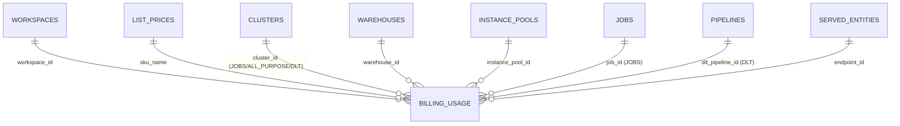
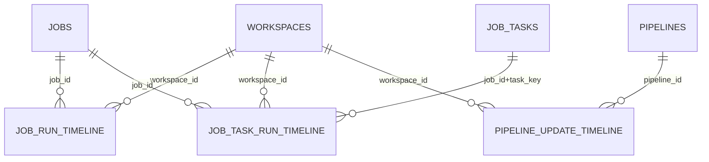
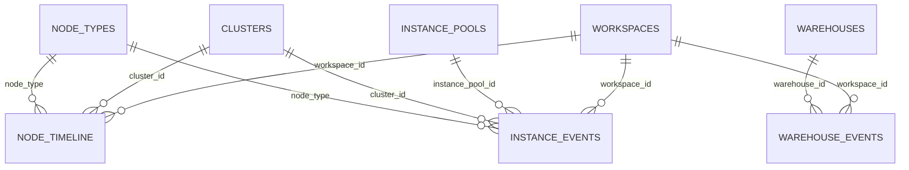
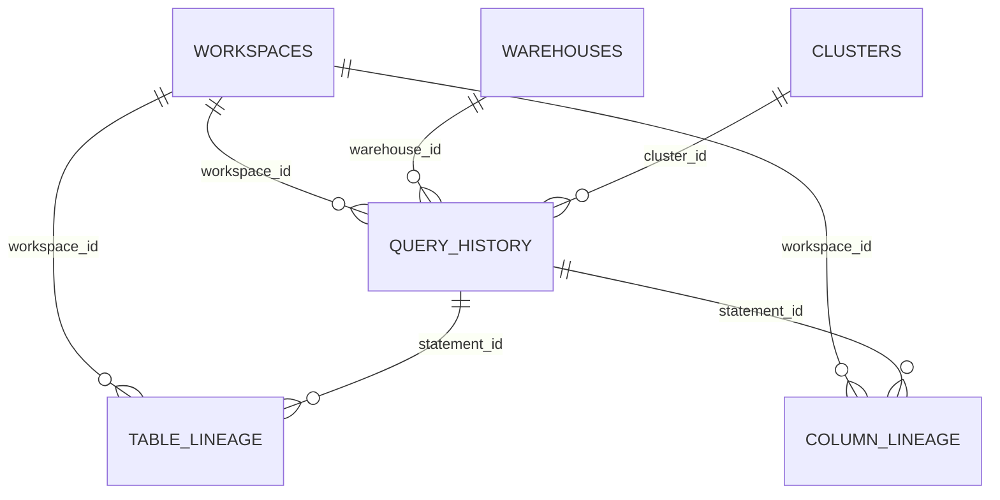
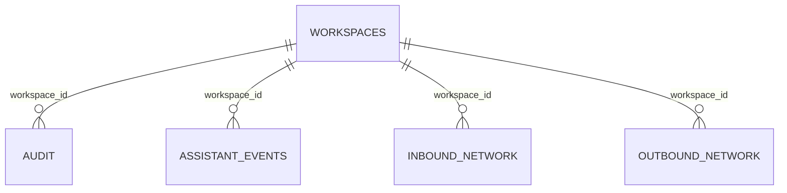
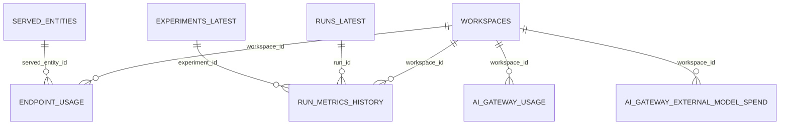
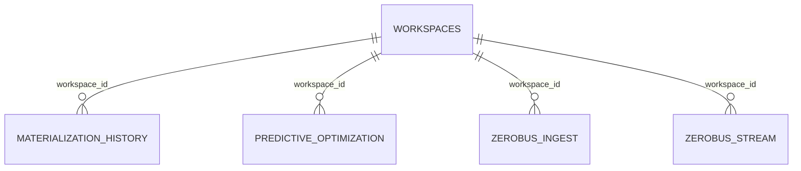

# System Tables ERD — by family

Readable, per-family views of the validated one-layer star models. All edges are
**N:1 (fact → dimension)**, crow's-foot pointing at the many/fact side; labels are
join keys. `access.workspaces_latest` (WORKSPACES) is the universal dimension shared
by nearly every fact — shown in each family rather than as one central hairball.

Legend: `_SCD` = point-in-time join; `_PK`/`_lookup`/`_window` = equi-key join.

## Billing (cost/usage hub)

## Lakeflow (jobs & pipelines)

## Compute (utilization & events)

## Query & Lineage (query.history doubles as a dimension)

## Access events (workspace only)

## Serving / AI Gateway / MLflow

## Misc workspace-scoped facts

## Standalone facts (no star edge)

No `workspace_id`, no FK to any system dimension — single-table facts:
`data_quality_monitoring.table_results`, `replication.states`,
`access.clean_room_events`, `data_classification.results`.

---

The full single-diagram version is in [`erd.md`](erd.md) (rendered: `erd.png`).
Per-family PNGs: `erd_<family>.png`.
